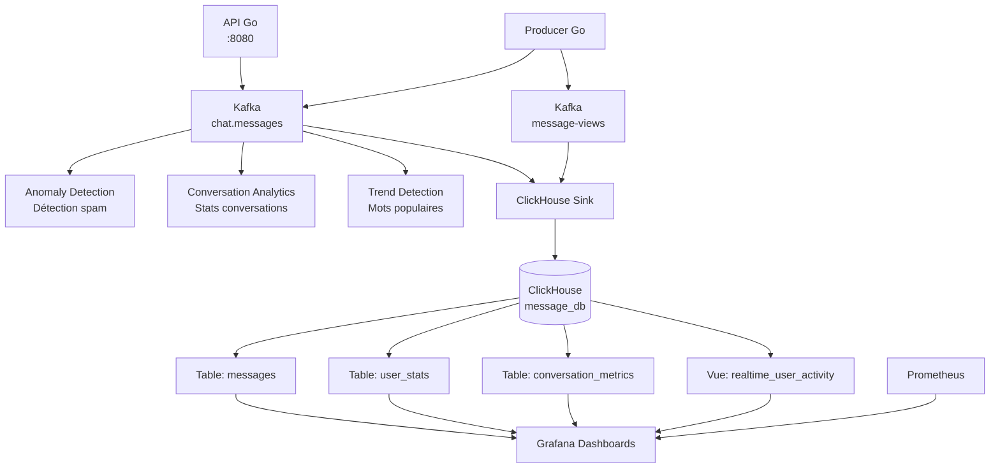
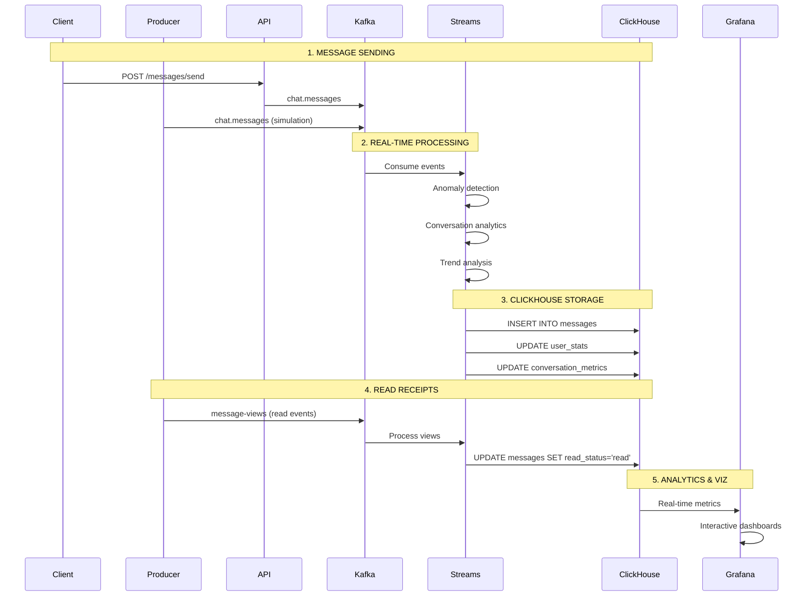
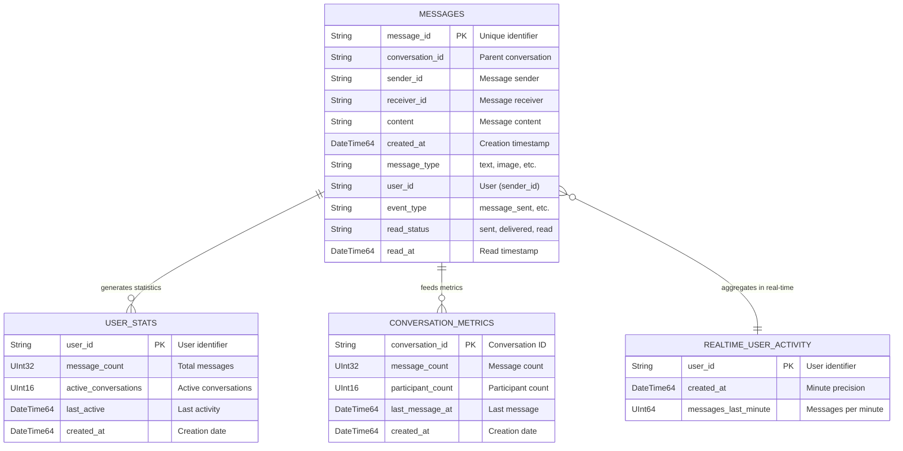

# 💬 Real-Time Messaging Analytics Platform

<div align="center">


**Intelligent message processing with real-time spam detection, trend analysis, and conversation analytics**

[](https://golang.org/)
[](https://kafka.apache.org/)
[](https://clickhouse.com/)
[](https://docker.com/)

</div>

## 🚀 Overview

A high-performance, real-time messaging platform that not only delivers messages but also provides instant analytics, spam detection, and trend analysis. Built with Go, Kafka Streams, and ClickHouse, this system processes thousands of messages per second while generating actionable insights.

### ✨ Key Features

- **📨 Real-time Message Processing** - End-to-end latency under 100ms
- **🚨 Smart Spam Detection** - Automatic detection of suspicious activity
- **📊 Conversation Analytics** - Live metrics and engagement tracking
- **🔥 Trend Analysis** - Identify popular topics and keywords
- **👁️ Read Receipt Tracking** - Monitor message engagement in real-time
- **📈 Interactive Dashboards** - Beautiful Grafana visualizations

## 🏗️ System Architecture

### High-Level Architecture



### Data Flow



## 🗃️ Database Schema



## 🛠️ Technologies Used

| Component | Technology | Purpose |
|-----------|------------|---------|
| **API Layer** | Go 1.19+ | REST API for message sending |
| **Stream Processing** | Kafka Streams (Scala) | Real-time data processing |
| **Message Broker** | Apache Kafka | Event streaming platform |
| **Analytics Database** | ClickHouse | High-performance OLAP database |
| **Monitoring** | Prometheus + Grafana | Metrics collection and visualization |
| **Containerization** | Docker + Docker Compose | Environment consistency |

## 📦 Installation & Setup

### Prerequisites

- Docker and Docker Compose
- 4GB RAM minimum
- Git

### Quick Start

1. **Clone the repository**
```bash
git clone https://github.com/your-username/message-tracking-system.git
cd message-tracking-system
```

2. **Start the system**
```bash
# Start all services
docker-compose up -d

# Wait for services to initialize
sleep 30

# Create Kafka topics
./kafka/create-topics.sh
```

3. **Verify installation**
```bash
# Check all services are running
docker-compose ps

# Test the API
curl http://localhost:8080/api/v1/health
```

### Access Points

| Service | URL | Purpose |
|---------|-----|---------|
| **API Gateway** | http://localhost:8080 | Message sending and management |
| **Grafana** | http://localhost:3000 | Analytics dashboards |
| **ClickHouse** | http://localhost:8123 | Database management |
| **Prometheus** | http://localhost:9090 | Metrics collection |

## 🎯 Usage Examples

### Sending Messages via API

```bash
# Send a message
curl -X POST http://localhost:8080/api/v1/messages/send \
  -H "Content-Type: application/json" \
  -d '{
    "sender_id": "alice",
    "receiver_id": "bob",
    "content": "Hello Bob! Let's discuss the project deadline.",
    "message_type": "text"
  }'

# Response
{
  "status": "success",
  "message_id": "msg-1705412345678901234",
  "conversation_id": "conv-abc123"
}
```

### Checking Conversation History

```bash
# Get conversation details
curl http://localhost:8080/api/v1/messages/conversation/conv-abc123

# Health check
curl http://localhost:8080/api/v1/health
```

### Sample Producer Output
```
💬 [conv-1] alice → bob: Hello Bob! Let's discuss the project deadline.
👀 Message view: msg-123456789 read by bob
🚨 ANOMALY: charlie sent 12 messages/min
🔥 TREND: 'deadline' used 8 times in 2min
```

## 🔧 Configuration

### Environment Variables

| Service | Variables | Default |
|---------|-----------|---------|
| **API Service** | `SERVER_PORT` | `8080` |
| **Kafka** | `KAFKA_BROKERS` | `kafka:9092` |
| **ClickHouse** | `CLICKHOUSE_URL` | `clickhouse:9000` |
| **Producer** | `PRODUCER_MODE` | `kafka` |

### Kafka Topics

| Topic | Partitions | Purpose |
|-------|------------|---------|
| `chat.messages` | 4 | Incoming messages |
| `message-views` | 4 | Read receipt events |
| `anomaly.alerts` | 2 | Spam detection alerts |

## 📊 Analytics & Monitoring

### Key Metrics Tracked

- **User Activity**: Messages per minute, active conversations
- **Engagement Rates**: Message read rates, response times
- **System Performance**: Processing latency, error rates
- **Business Insights**: Popular topics, conversation patterns

### Sample ClickHouse Queries

```sql
-- Most active users
SELECT 
    user_id,
    count(*) as message_count,
    max(created_at) as last_activity
FROM message_db.messages 
WHERE created_at >= now() - 3600
GROUP BY user_id 
ORDER BY message_count DESC;

-- Conversation health
SELECT 
    conversation_id,
    count(*) as total_messages,
    countDistinct(sender_id) as participants
FROM message_db.messages
GROUP BY conversation_id
ORDER BY total_messages DESC;

-- Real-time spam detection
SELECT 
    user_id,
    count(*) as messages_last_5min
FROM message_db.messages 
WHERE created_at >= now() - 300
GROUP BY user_id
HAVING messages_last_5min > 20;
```

## 🚀 Performance Characteristics

| Metric | Value | Description |
|--------|-------|-------------|
| **Throughput** | 10,000+ msg/sec | Message processing capacity |
| **Latency** | < 100ms | End-to-end processing time |
| **Data Retention** | 30 days | ClickHouse data retention |
| **Concurrent Users** | 1,000+ | Simulated user capacity |

## 🗂️ Project Structure

```
message-tracking-system/
├── docker-compose.yml          # Full environment setup
├── message-producer/           # Go message simulator
│   ├── main.go                 # Producer logic
│   ├── go.mod                  # Dependencies
│   └── Dockerfile              # Container definition
├── services/                   # Kafka Streams applications
│   ├── anomaly-detection/      # Spam detection service
│   ├── conversation-analytics/ # Conversation metrics
│   ├── trend-detection/        # Word trend analysis
│   └── clickhouse-sink/        # Database storage
├── databases/
│   └── clickhouse/             # Database configuration
├── monitoring/
│   ├── prometheus/             # Metrics collection
│   └── grafana/                # Dashboards
└── kafka/
    └── create-topics.sh        # Topic management
```

## 🔍 Troubleshooting

### Common Issues

1. **Kafka not ready**
```bash
# Wait for Kafka to initialize
docker-compose logs kafka | grep "started"

# Check topic creation
docker-compose exec kafka kafka-topics.sh --list --bootstrap-server localhost:9092
```

2. **ClickHouse connection issues**
```bash
# Test connection
docker-compose exec clickhouse clickhouse-client --query "SHOW DATABASES"

# Check table creation
docker-compose exec clickhouse clickhouse-client --query "SHOW TABLES FROM message_db"
```

3. **Service health checks**
```bash
# Check all services
./scripts/health-check.sh

# View logs
docker-compose logs -f [service-name]
```

### Monitoring

- **Grafana**: http://localhost:3000 (admin/admin)
- **Service Logs**: `docker-compose logs -f`
- **Kafka UI**: Monitor message flow (if configured)

## 🤝 Contributing

We welcome contributions! Please see our [Contributing Guide](CONTRIBUTING.md) for details.

1. Fork the repository
2. Create a feature branch (`git checkout -b feature/amazing-feature`)
3. Commit your changes (`git commit -m 'Add amazing feature'`)
4. Push to the branch (`git push origin feature/amazing-feature`)
5. Open a Pull Request

## 📄 License

This project is licensed under the MIT License - see the [LICENSE](LICENSE) file for details.

## 🙏 Acknowledgments

- Apache Kafka for reliable streaming
- ClickHouse for blazing-fast analytics
- Grafana for beautiful visualizations
- The Go community for excellent libraries

---

<div align="center">

**Built with ❤️ for real-time messaging analytics**

*If you find this project helpful, please give it a ⭐!*

</div>

## 📞 Support

- 📧 **Email**: your-email@example.com
- 🐛 **Issues**: [GitHub Issues](https://github.com/your-username/message-tracking-system/issues)
- 💬 **Discussions**: [GitHub Discussions](https://github.com/your-username/message-tracking-system/discussions)
